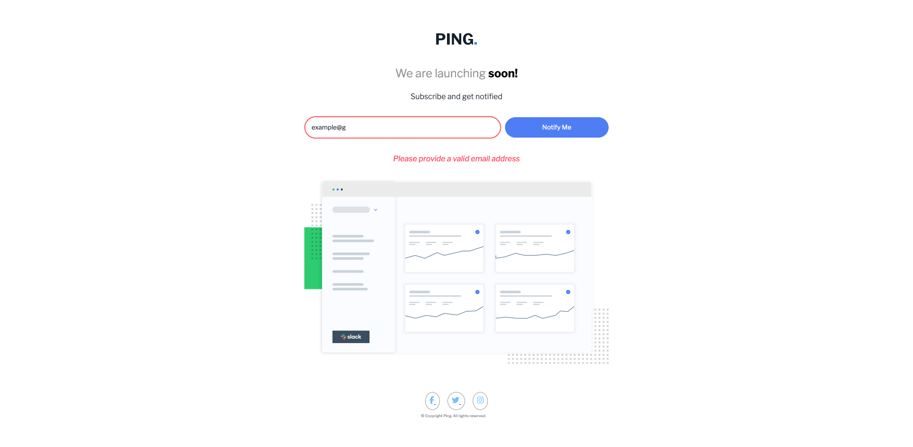
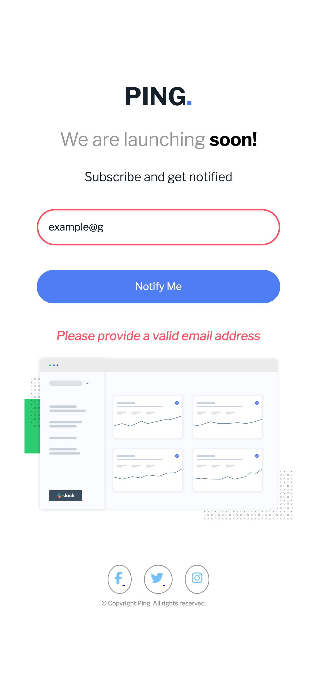

# Frontend Mentor - Ping coming soon page solution

This is a solution to the [Ping coming soon page challenge on Frontend Mentor](https://www.frontendmentor.io/challenges/ping-single-column-coming-soon-page-5cadd051fec04111f7b848da). Frontend Mentor challenges help you improve your coding skills by building realistic projects.

## Table of contents

- [Overview](#overview)
  - [The challenge](#the-challenge)
  - [Screenshot](#screenshot)
  - [Links](#links)
- [My process](#my-process)
  - [Built with](#built-with)
  - [What I learned](#what-i-learned)
  - [Continued development](#continued-development)
  - [Useful resources](#useful-resources)
- [Author](#author)
- [Acknowledgments](#acknowledgments)

## Overview

### The challenge

Users should be able to:

- View the optimal layout for the site depending on their device's screen size
- See hover states for all interactive elements on the page
- Submit their email address using an `input` field
- Receive an error message when the `form` is submitted if:
  - The `input` field is empty. The message for this error should say _"Whoops! It looks like you forgot to add your email"_
  - The email address is not formatted correctly (i.e. a correct email address should have this structure: `name@host.tld`). The message for this error should say _"Please provide a valid email address"_

### Screenshot




### Links

- Solution URL: [Github](https://github.com/LySabrina/Ping_Single_Column)
- Live Site URL: [Add live site URL here](https://your-live-site-url.com)

## My process

### Built with

- Semantic HTML5 markup
- CSS custom properties
- Flexbox
- Mobile-first workflow

### What I learned

I learned more about form validation and regex. In this project, it requires the use of JS. For the error-message, I tried create a `<p>` tag and putting it beneath the form. But this would result it creating more `<p>` tags whenever the user had an invalid email address being submitted. Thus I just created an error message and put it's display to none and turn it to block if there exist an invalid email address.

I learned how to create elements and adding it next to elements using these javascript browser methods:

```js
const error_message = document.createElement("p");
error_message.textContent = "Please provide a valid email address";
error_message.classList.add("error");
form.insertAdjacentElement("afterend", error_message);
```

Additionally, I learned more about regex. I created a function that checks if the string being submitted as an email is valid by using this anonymous arrow function:

```js
const emailValid = (email) => {
  const regex = /[A-Za-z][A-Za-z0-9][A-Za-z0-9]+@[A-Za-z]+\.(com|org)/;
  return regex.test(email);
};
```

The regex variable is using regex literal. This is seen from using the forward slashes in the beginning and end.
The regex states that the user's email will need at least 3 characters. The first character is any uppercase and lowercase letters. The second and third is the same but includes numbers. Then the + sign states that this go on from 1 to N. Finally we use an @ sign. Next is the domain which must have at least one charcter that is uppercase or lowercase. Finally we need a period and any com or org ending.

Email address are more complex than that but I simplified it for now as I was learning how to write regex.

### Continued development

No continue development is needed but a further study of regex and form validation is needed.

### Useful resources

- [Regex](https://regexone.com/lesson/introduction_abcs) - Has helped me understand regex
- [Mozilla Form Validation](https://developer.mozilla.org/en-US/docs/Learn/Forms/Form_validation#built-in_form_validation_examples) - Has helped me understand form validation

## Author

- Frontend Mentor - [@lysabrina](https://www.frontendmentor.io/profile/LySabrina)
- GitHub - [@lysabrina](https://github.com/LySabrina)

## Acknowledgments

Thanks to FrontendMentor for the projects and me!.
Also watch Dungeon Meshi. It's good.
